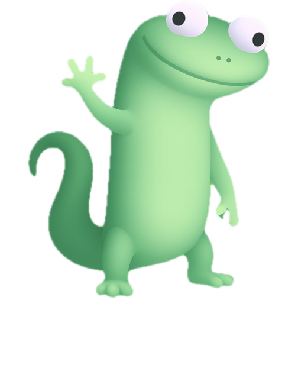

# 🦎 Lizard

A delightful physics simulation game where you spawn adorable lizard emojis that interact with realistic physics, gravity, and device motion.

Available for **iOS** and **Apple Watch** with platform-optimized experiences.



## 📱 Platform Support

### iOS Version
Full-featured physics simulation with advanced graphics and controls.

### ⌚ Apple Watch Version  
Simplified companion app optimized for quick interactions and watch hardware.
See [watchOS documentation](docs/WATCHOS.md) for details.

## ✨ Features

### 🎮 Core Gameplay
- **Physics Simulation**: Realistic physics using SpriteKit with gravity and collision detection
- **Lizard Spawning**: Tap the main button to spawn individual lizards with random velocities
- **Rain Mode**: Hold the rain button to continuously spawn multiple lizards
- **Tilt Controls**: Use device motion to control gravity direction

### 🌅 Visual Experience  
- **Dynamic Weather Backgrounds**: Enhanced time-of-day reactive backgrounds with dynamic weather effects
  - Real-time weather conditions with animated sky transitions
  - Moving clouds with dynamic opacity and layering
  - Animated sun with rays and position tracking
  - Rain effects with realistic screen raindrops
  - Enhanced sunrise/sunset transitions
  - Stars and moon at night with weather interaction
- **Weather Control System**: Manual weather control with auto/manual mode toggle
- **Liquid Glass UI**: Modern, translucent button styling with depth effects
- **Smooth Animations**: 120 FPS performance optimization

### 🎵 Audio & Feedback
- **Sound Effects**: Audio feedback for lizard spawning
- **Silent Mode Support**: Audio works even when device is in silent mode
- **Haptic Feedback**: Responsive touch interactions

### 🏆 Game Center Integration
- **Leaderboards**: 
  - Total Lizards Spawned
  - Button Taps Counter
- **Achievements**:
  - First 100 lizards spawned
  - First 500 lizards spawned  
  - 100 button taps milestone
- **Access Point**: Floating Game Center trophy icon

### 🧪 Beta Features
- **Screenshot Feedback**: Take a screenshot during TestFlight to automatically open feedback composer
- **Performance Monitoring**: Automatic FPS tracking and optimization

## 🎯 How to Play

1. **Spawn Lizards**: Tap the large center button (🦎) to spawn a single lizard
2. **Rain Mode**: Hold the rain button (🌧️) to continuously spawn lizards
3. **Tilt Control**: Tilt your device to change gravity direction and watch lizards move
4. **Stop/Clear**: Use the stop button (🛑) to pause or trash button (🗑️) to clear all lizards
5. **Game Center**: Track your progress and compete on leaderboards

## 🔧 Controls

| Control | Action |
|---------|--------|
| Center Button Tap | Spawn single lizard |
| Center Button Hold | Continuous spawning |
| Rain Button Tap | Spawn burst of lizards |
| Rain Button Hold | Continuous rain mode |
| Stop Button | Pause physics aging |
| Clear Button | Remove all lizards |
| Device Tilt | Control gravity direction |

## 📱 Requirements

- iOS 18.0+
- Device with accelerometer/gyroscope for tilt controls
- Game Center account (optional, for leaderboards and achievements)

## 🏗️ Technical Details

- **Framework**: SwiftUI + SpriteKit
- **Physics**: Custom physics simulation with performance optimization
- **Audio**: AVFoundation with multi-voice sound pooling
- **Motion**: CoreMotion for device orientation and gravity
- **Persistence**: UserDefaults for score tracking
- **Performance**: Automatic lizard lifecycle management (10-second lifespan)

## 🎨 Architecture

- `LizardApp.swift` - Main app entry point and lifecycle management
- `ContentView.swift` - Primary game UI and controls
- `LizardScene.swift` - SpriteKit physics simulation scene
- `GameCenterManager.swift` - Game Center integration and leaderboards
- `DynamicBackgroundView.swift` - Time-based background rendering
- `SoundPlayer.swift` - Audio management and pooling
- `BetaFeedbackManager.swift` - TestFlight feedback system

## 🚀 Development

This project uses Xcode and Swift. The app is optimized for iPhone and supports both portrait orientations.

### Building the Project

For comprehensive build instructions, see [`BUILDING.md`](BUILDING.md).

#### Quick Build (iOS Only)
```bash
# Open in Xcode
open Lizard.xcodeproj

# Or build from command line
xcodebuild -project Lizard.xcodeproj -scheme Lizard -configuration Debug
```

#### 🍎 watchOS Integration

The project includes complete watchOS app source code. To integrate:

1. **Run the helper script**: `./scripts/watchos-integration-helper.sh`
2. **Follow the integration guide**: See [`docs/WATCHOS_INTEGRATION.md`](docs/WATCHOS_INTEGRATION.md)
3. **Add targets in Xcode**: watchOS app, tests, and iOS tests

After integration, you'll have both iOS and watchOS versions in a single project.

### Performance Optimizations
- Maximum 300 concurrent physics objects
- Automatic cleanup of aged lizards (10s lifespan)
- FPS monitoring and dynamic quality adjustment
- Rate-limited sound effects

### Game Center Setup
The app includes three achievements and two leaderboards. Game Center configuration is handled automatically on first launch.

## 📄 License

[Add your license information here]

## 🤝 Contributing

[Add contribution guidelines here]

---

*Made with ❤️ for physics simulation enthusiasts*